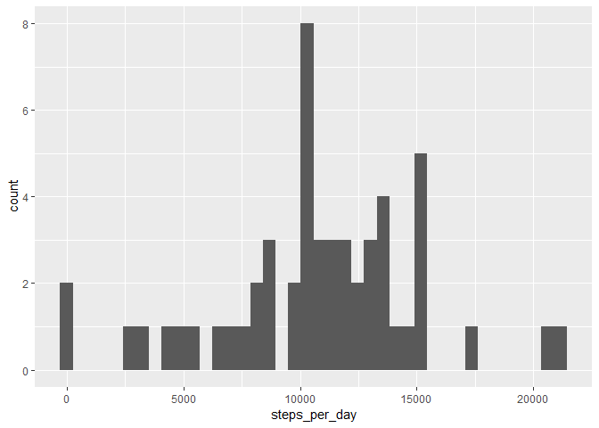
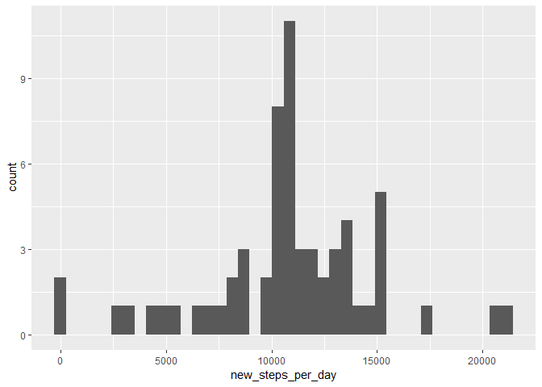
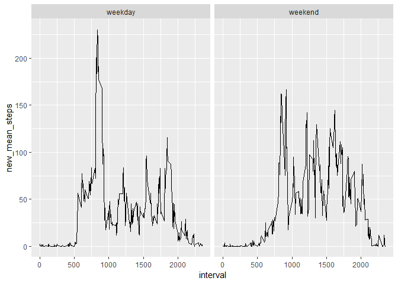

## Get the data  


```r
url <- "https://github.com/vincentpalacios/RepData_PeerAssessment1/raw/master/activity.zip"
download.file(url = url, destfile = "activity.zip")
unzip(zipfile = "activity.zip")
```

## Loading and preprocessing the data  


```r
# 1. Load the data (i.e. read.csv())
mydata <- read.csv("activity.csv")

# 2. Process/transform the data (if necessary) into a format suitable for your
# analysis
mydata <- as_tibble(mydata)
str(mydata)
```

```
## Classes 'tbl_df', 'tbl' and 'data.frame':	17568 obs. of  3 variables:
##  $ steps   : int  NA NA NA NA NA NA NA NA NA NA ...
##  $ date    : Factor w/ 61 levels "2012-10-01","2012-10-02",..: 1 1 1 1 1 1 1 1 1 1 ...
##  $ interval: int  0 5 10 15 20 25 30 35 40 45 ...
```

```r
names(mydata)
```

```
## [1] "steps"    "date"     "interval"
```

```r
summary(mydata)
```

```
##      steps                date          interval     
##  Min.   :  0.00   2012-10-01:  288   Min.   :   0.0  
##  1st Qu.:  0.00   2012-10-02:  288   1st Qu.: 588.8  
##  Median :  0.00   2012-10-03:  288   Median :1177.5  
##  Mean   : 37.38   2012-10-04:  288   Mean   :1177.5  
##  3rd Qu.: 12.00   2012-10-05:  288   3rd Qu.:1766.2  
##  Max.   :806.00   2012-10-06:  288   Max.   :2355.0  
##  NA's   :2304     (Other)   :15840
```

```r
head(mydata)
```

```
## # A tibble: 6 x 3
##   steps date       interval
##   <int> <fct>         <int>
## 1    NA 2012-10-01        0
## 2    NA 2012-10-01        5
## 3    NA 2012-10-01       10
## 4    NA 2012-10-01       15
## 5    NA 2012-10-01       20
## 6    NA 2012-10-01       25
```

## What is mean total number of steps taken per day?  


```r
# 1. Calculate the total number of steps taken per day
(daily_steps <- mydata %>% group_by(date) %>% summarise(steps_per_day = sum(steps)))
```

```
## # A tibble: 61 x 2
##    date       steps_per_day
##    <fct>              <int>
##  1 2012-10-01            NA
##  2 2012-10-02           126
##  3 2012-10-03         11352
##  4 2012-10-04         12116
##  5 2012-10-05         13294
##  6 2012-10-06         15420
##  7 2012-10-07         11015
##  8 2012-10-08            NA
##  9 2012-10-09         12811
## 10 2012-10-10          9900
## # ... with 51 more rows
```

```r
# 2. If you do not understand the difference between a histogram and a barplot,
# research the difference between them. Make a histogram of the total number of
# steps taken each day
daily_steps %>% 
  ggplot() +
  geom_histogram(aes(x = steps_per_day), bins = 40)
```

```
## Warning: Removed 8 rows containing non-finite values (stat_bin).
```

<!-- -->

```r
# 3. Calculate and report the mean and median of the total number of steps taken
# per day
(summary_steps <- daily_steps %>% summarise(mean_steps = mean(steps_per_day, na.rm = TRUE), 
                                            median_steps = median(steps_per_day, na.rm = TRUE)))
```

```
## # A tibble: 1 x 2
##   mean_steps median_steps
##        <dbl>        <int>
## 1     10766.        10765
```

## What is the average daily activity pattern?  


```r
# 1. Make a time series plot (i.e. type="l") of the 5-minute interval (x-axis)
# and the average number of steps taken, averaged across all days (y-axis)
(steps <- mydata %>% group_by(interval) %>% summarise(mean_steps = mean(steps, na.rm = TRUE)))
```

```
## # A tibble: 288 x 2
##    interval mean_steps
##       <int>      <dbl>
##  1        0     1.72  
##  2        5     0.340 
##  3       10     0.132 
##  4       15     0.151 
##  5       20     0.0755
##  6       25     2.09  
##  7       30     0.528 
##  8       35     0.868 
##  9       40     0     
## 10       45     1.47  
## # ... with 278 more rows
```

```r
ggplot(steps) +
  geom_line(aes(x = interval, y = mean_steps))
```

<!-- -->

```r
# 2. Which 5-minute interval, on average across all the days in the dataset,
# contains the maximum number of steps?
steps[steps$mean_steps == max(steps$mean_steps), ]
```

```
## # A tibble: 1 x 2
##   interval mean_steps
##      <int>      <dbl>
## 1      835       206.
```

## Imputing missing values  


```r
# 1. Calculate and report the total number of missing values in the dataset
# (i.e. the total number of rows with NAs)
sum(!complete.cases(mydata))
```

```
## [1] 2304
```

```r
# 2. Devise a strategy for filling in all of the missing values in the dataset. 
# The strategy does not need to be sophisticated. For example, you could use the
# mean/median for that day, or the mean for that 5-minute interval, etc.

# To impute missing values, I will join the mean steps taken for each interval
# to the original data, and then replace missing values with their interval's
# mean.

# 3. Create a new dataset that is equal to the original dataset but with the
# missing data filled in.
new_data <- mydata %>% left_join(., steps, by = "interval") %>% 
  mutate(steps = case_when(
    is.na(steps) ~ mean_steps,
    TRUE         ~ as.double(steps))) %>% 
  select(new_steps = steps, date, interval)

# 4. Make a histogram of the total number of steps taken each day and Calculate
# and report the mean and median total number of steps taken per day. Do these
# values differ from the estimates from the first part of the assignment? What
# is the impact of imputing missing data on the estimates of the total daily
# number of steps?
new_data %>% group_by(date) %>% summarise(new_steps_per_day = sum(new_steps)) %>% 
  ggplot() +
  geom_histogram(aes(x = new_steps_per_day), bins = 40)
```

<!-- -->

```r
new_daily_steps <- new_data %>% group_by(date) %>% 
  summarise(new_steps_per_day = sum(new_steps, na.rm = TRUE))

(new_summary_steps <- new_daily_steps %>% 
    summarise(new_mean_steps = mean(new_steps_per_day, na.rm = TRUE), 
              new_median_steps = median(new_steps_per_day, na.rm = TRUE)))
```

```
## # A tibble: 1 x 2
##   new_mean_steps new_median_steps
##            <dbl>            <dbl>
## 1         10766.           10766.
```

```r
# The impact of imputing missing values is an increase in the median by one 
# step, but the mean stays the same. So imputing with the meanhere has little 
# impact on these measures in this case, but affects the histogram. Arguably,
# this is an improvement there.
```


## Are there differences in activity patterns between weekdays and weekends?  


```r
# 1. Create a new factor variable in the dataset with two levels – “weekday” and
# “weekend” indicating whether a given date is a weekday or weekend day.
new_data <- new_data %>% 
  mutate(weekday = weekdays(ymd(date)),
         weekday = case_when(
           !(weekday  %in% c("Saturday", "Sunday")) ~ "weekday",
            (weekday  %in% c("Saturday", "Sunday")) ~ "weekend"
         ))

# 2. Make a panel plot containing a time series plot (i.e.
# \color{red}{\verb|type = "l"|}type="l") of the 5-minute interval (x-axis) and
# the average number of steps taken, averaged across all weekday days or weekend
# days (y-axis). See the README file in the GitHub repository to see an example
# of what this plot should look like using simulated data.
new_steps <- new_data %>% group_by(weekday, interval) %>% 
  summarise(new_mean_steps = mean(new_steps, na.rm = TRUE))
new_steps %>% 
  ggplot() +
  geom_line(aes(x = interval, y = new_mean_steps)) +
  facet_wrap( ~ weekday)
```

<!-- -->

